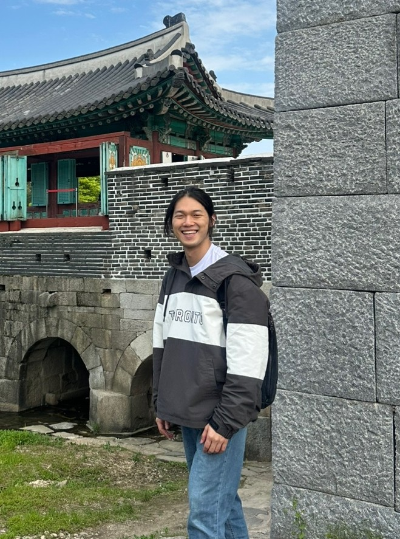

# Yong-Woo Lee / 이용우 / 李鎔宇

<table cellspacing="0" cellpadding="0">
  <tr>
    <td width="80%">Welcome! I am a PhD student studying in the Department of Mathematical Sciences in Seoul National University, advised by <a href="https://sites.google.com/view/sungsoobyun/welcome">Sung-Soo Byun</a>. I am interested in probability theory and complex analysis, especially on random matrix theory.   
    I am a student member of <a href="https://sites.google.com/view/snuprob/">SNU Probability Group</a>.</td>
    <td width ="20%"></td>
  </tr>
</table>

## Preprints & Publications


## Talks & Posters

